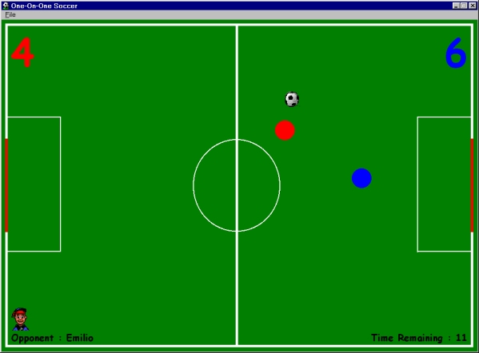



## \_\*\*A Cool One\-On\-One Soccer Game\*\*

### Description

A very fun to play one-on-one soccer game. You can play against either a friend or the computer. I haven't seen a soccer game written in VB yet so I thought I'd make one. I used a game library I made that has some functions that helps calculate collision detection and artifical intelligence. Feel free to use it in your own games - I hope you find it useful. This game is more of a fun game. It's a bit silly but nevertheless enjoyable. Please vote (what you think it deserves) and gives as much feedback as possible. I would like to know what you think of it.
 
### More Info
 

             |
---                |---
**Submitted On**   |2001-08-20 18:03:40
**By**             |[Rosh Mendis](https://github.com/Planet-Source-Code/PSCIndex/blob/master/ByAuthor/rosh-mendis.md)
**Level**          |Intermediate
**User Rating**    |4.8 (318 globes from 66 users)
**Compatibility**  |VB 5\.0, VB 6\.0
**Category**       |[Games](https://github.com/Planet-Source-Code/PSCIndex/blob/master/ByCategory/games__1-38.md)
**World**          |[Visual Basic](https://github.com/Planet-Source-Code/PSCIndex/blob/master/ByWorld/visual-basic.md)
**Archive File**   |[\_\_\_A\_Cool\_59730362002\.zip](https://github.com/Planet-Source-Code/rosh-mendis-a-cool-one-on-one-soccer-game__1-25598/archive/master.zip)

